# CaseThread

**A case-room platform where any team — legal, academic, corporate, medical, or technical — can spin up a private, secure workspace in minutes and manage an entire case in one place.**

## The Problem

Any group collaborating around a structured problem — an investigation, a legal matter, a misconduct hearing — hits the same three failures: **evidence scattered** across email and drives, **access control** that's either too loose or requires an IT ticket, and **no visible connections** between who said what and what contradicts what. Existing tools (Kaseware, goCASE, Cellebrite) serve large agencies with procurement cycles — nobody serves a legal team, an integrity board, and a fraud unit with the same lightweight tool.

CaseThread's answer: **Case Rooms** with code-based access, role-based permissions enforced in the database, and pluggable domain modules on one shared core — evidence vault, case timeline, threaded discussion, tasks, and an immutable audit log.

## How CaseThread Compares

| | Shared folders (Drive/Dropbox) | Enterprise case tools (Kaseware/goCASE) | **CaseThread** |
|---|---|---|---|
| Time to start | Instant | Days–weeks (IT provisioning) | **Minutes (join code)** |
| Role-based access | Manual folder permissions | Yes, admin-managed | **Yes, enforced via Postgres RLS** |
| Immutable audit trail | No | Yes | **Yes, append-only at the DB layer** |
| Case timeline & entity map | No | Partial | **Yes (timeline + recursive-CTE entity map)** |
| AI assistance | No | No | **Yes — human-in-the-loop agents (live)** |
| Cost/complexity | Low | High | **Low (Supabase-backed, single Flutter codebase)** |

## Tech Stack


- **Flutter** — one codebase → Web, Android, iOS
- **Supabase** — Postgres with Row-Level Security as the real permission boundary, Auth, Storage, Realtime
- **Riverpod** — testable, compile-safe state management
- **AI adapter layer** (Edge Function) — Claude, GPT, Gemini, or Grok behind one interface; swapping providers is a config flip (`AI_PROVIDER`), never a core-logic change
- **GitHub Actions + Vercel** — CI on every PR, preview deploys

## AI Agent Workflows (Phase 3, live)



Agents analyze a room's timeline and evidence, then flag findings as **pending suggestions** — visually distinct (amber) from confirmed case data. Nothing an agent produces can touch the case record: only a Lead-tier human can **accept**, **edit**, or **dismiss** a finding, and every decision lands in the immutable audit trail atomically with the resulting timeline event. Domain agents ship as versioned config data (not code): Contradiction Checker (legal), Financial Anomaly Detector (corporate), Root-Cause Suggester (technical), Literature Summarizer (academic), Diagnostic Differential Assistant (medical). The workflow builder chains agents into saved pipelines — every step still produces its own pending suggestion for individual review.

## Status

**Phases 1–5 COMPLETE; Phase 6 (spec alignment + v3 console) COMPLETE — all local gates green.** All five case-type domains (Legal, Academic, Corporate, Technical, Medical) run on one config-driven core; field-level redaction enforced in the database; watermark-based activity feed; permission-gated case export; entity-relationship map with transitive chains; template marketplace; cross-case search; offline-first sync with conflict resolution; version history; and the investigation-intelligence layer — alibi verification, contradiction tracking, investigation gaps, Fact/Claim/Finding/Unknown classification, case dashboard with live statistics, and the investigation status/closed-summary lifecycle. The full MVP works end-to-end against the live backend: sign up → create room → join by code → owner approval → role-scoped access → evidence vault (sha256 chain-of-custody, auto-versioning) → realtime timeline/discussion/tasks → immutable audit trail → **AI agent runs with human-in-the-loop review** (accept/edit/dismiss, each audited) and a **workflow builder** that chains agents into saved pipelines. Five domain agents live as versioned config rows; the AI adapter normalizes Claude/GPT/Gemini/Grok behind one interface (provider swap = env var, no core changes). The Flutter shell is now aligned to the approved v3 "Investigation Console" design — Geist typography, topbar/rail/cases shell, overview hero with stat tiles and graphs, live attention counts, and an animated connections graph. Full schema with Row-Level Security on every table, enforced in Postgres. 39 migrations. 27 pgTAP test files (232 declared tests) + 118 Dart tests + 9 Deno provider contract tests green locally (pgTAP run gated by Docker/CI availability); the v3 polish tail — mobile bottom nav, notifications sheet, invite copy-link, chat bubbles, vault search/filter chips, timeline restyle — is merged into the phase-6 branch. See [Phases.md](./Phases.md) for the roadmap, [HANDOFF.md](./HANDOFF.md) for exact current state, and [ExecutionPlan.md](./ExecutionPlan.md) for the sprint-by-sprint plan.

## Local Development

Prerequisites: Flutter 3.47.x ([install](https://docs.flutter.dev/get-started/install)), a [Supabase](https://supabase.com) project (free tier works).

```bash
flutter pub get

# Configure (non-web): copy .env.example → .env, fill in your values
# from Supabase Dashboard → Project Settings → API
cp .env.example .env

# Run on Android emulator / desktop
flutter run

# Run on web (config via dart-define — web can't read .env)
flutter run -d chrome \
  --dart-define=SUPABASE_URL=YOUR_URL \
  --dart-define=SUPABASE_ANON_KEY=YOUR_KEY
```

Quality gates before any PR (Rules.md):

```bash
dart format .
flutter analyze   # zero warnings required
flutter test
```

### Database tests (RLS contract suite)

The pgTAP suite in `supabase/tests/db/` is the non-negotiable security gate (Rules.md §7). It runs in CI on every push, and locally with Docker:

```bash
# One-time: install Docker Desktop, then from the project root
npx supabase start --exclude studio,imgproxy,edge-runtime,logflare,vector,realtime,storage-api
npx supabase db reset   # applies all migrations in order to local Postgres
npx supabase test db    # runs the pgTAP suite with full pg_prove output
```

Local Postgres listens on port **65432** (not the CLI default 54322 — this machine's Hyper-V reserves 54262–54361). `supabase stop` shuts the stack down when done.

> History: this suite was developed against a blind 4-minute CI loop, which caught nothing until Docker enabled the exact same `db reset + test db` loop locally. Prefer the local loop for RLS work; CI is the confirmation gate, not the debugger.

### AI adapter contract tests (Edge Function)

The provider adapter (mock / grok / openai / anthropic / gemini) is contract-tested with stubbed `fetch` — no live vendor calls, no keys:

```bash
deno test --no-check --allow-env supabase/functions/ai-agent/index.test.ts
```

## Documentation

- [PRD.md](./PRD.md) — problem, personas, KPIs, requirements
- [Architecture.md](./Architecture.md) — tech stack, data model, security model
- [Phases.md](./Phases.md) — phased roadmap (Phase 1–4)
- [ExecutionPlan.md](./ExecutionPlan.md) — sprint-by-sprint execution plan
- [Design.md](./Design.md) — design system (tokens, typography, components)
- [Rules.md](./Rules.md) — binding coding/security/testing standards
- [memory.md](./memory.md) — living project state summary

## License

All rights reserved. This code is publicly visible for portfolio/demonstration purposes; no license is granted for reuse, modification, or redistribution without permission.
